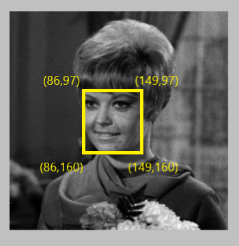

# Face encryption & decryption
Digital system design project  
e-mail address : jinwoong.it@gmail.com  
Detail description : info file  

## Introduction
- FPGA programming
- Use [LFSR(Linear Feedback Shift Register)](https://simplefpga.blogspot.com/2013/02/random-number-generator-in-verilog-fpga.html)    
- 난수 생성을 통한 이미지 encryption & decryption  

## Main Technology
- Verilog  

## Development Environment
- Xilinx Vivado  

## Screenshots
- encryption 영역  
  
- face encryption  
  
- face decryption  
